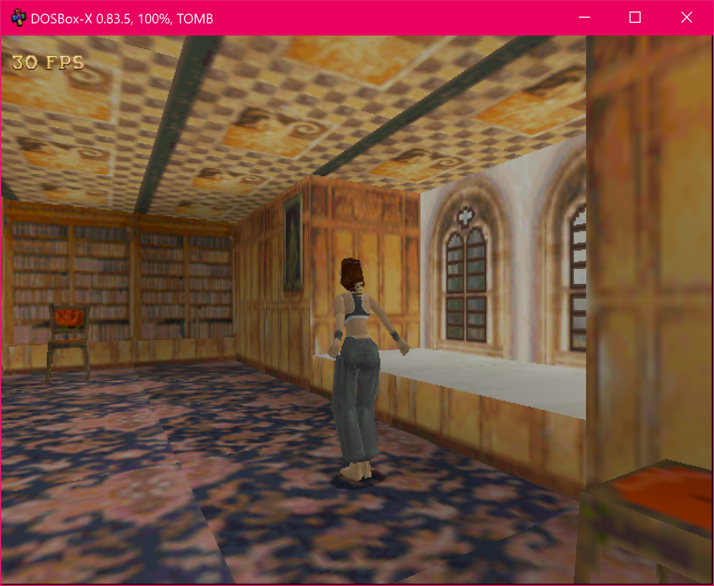
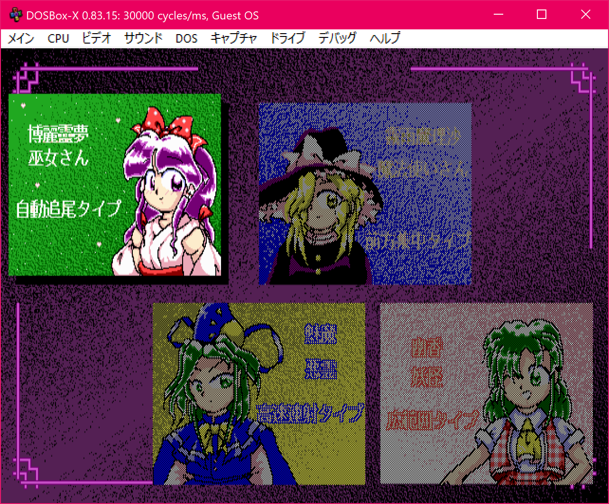
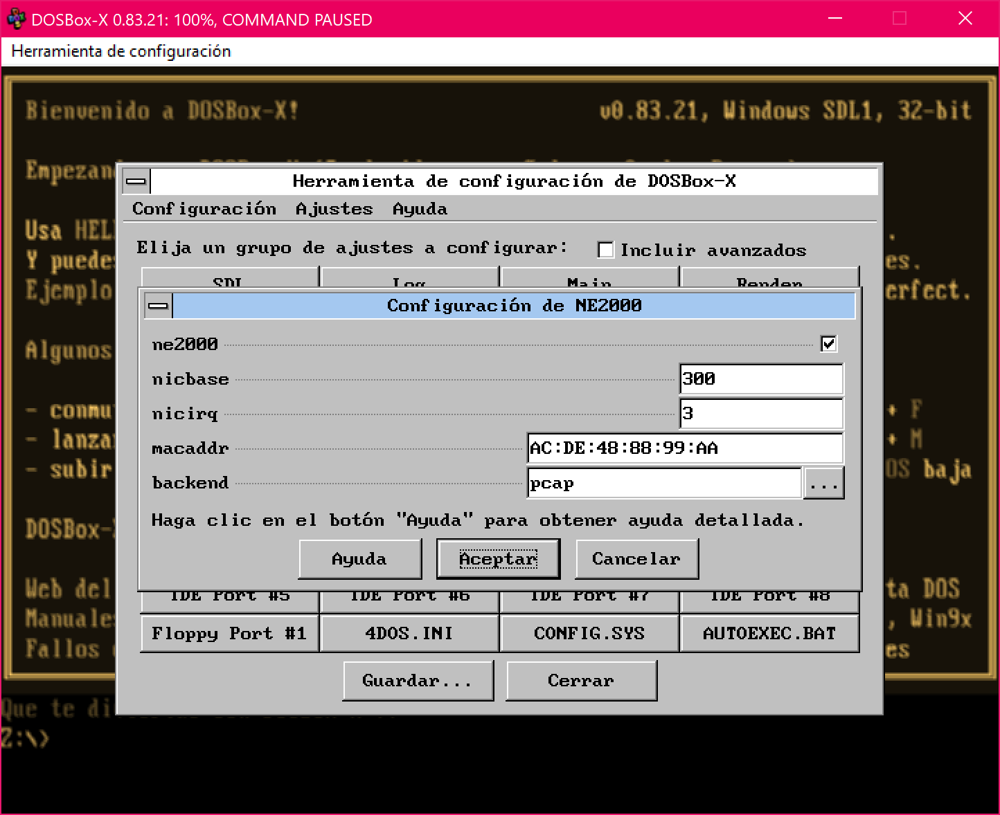

DOSBox-X emulates a PC necessary for running many DOS games and applications that simply cannot be run on modern PCs and operating systems, similar to [DOSBox](http://dosbox.com){:target="_blank"}. However, while the main focus of DOSBox is for running DOS games, DOSBox-X goes much further than this. Forked from the DOSBox project, it retains compatibility with the wide base of DOS games and DOS gaming DOSBox was designed for. But it is also a platform for running DOS applications, including emulating the environments to run Windows 3.x, 9x and Me and software written for those versions of Windows. By adding official support for Windows 95, 98, Me emulation and acceleration, we hope that those old Windows games and applications could be enjoyed or used once more. Moreover, DOSBox-X adds support for DOS/V and NEC PC-98 emulations so that you can play DOS/V and PC-98 games with it.

Compared with DOSBox, DOSBox-X focuses more on general emulation and accuracy. In order to help running DOS games and applications, Windows 3.x/9x/Me, as well as for the purpose of historical preservation, testing and continued DOS developments, it is our desire to implement accurate emulation, accurate enough to [help make new DOS developments possible](newdosdevelopment.html) with confidence the program will run properly on actual DOS systems. DOSBox-X includes various features for different purposes (some of them ported from other projects), which are implemented as incremental changes since it was forked from DOSBox SVN Daum. DOSBox-X provides many ways to tweak and configure the DOS virtual machine, as we believe a better way to emulate the DOS platform is to give users all the options they need to emulate everything from the original IBM PC system all the way up to late 1990's configuration, whatever it takes to get your game or software package to run. Our goal is to eventually make DOSBox-X a complete emulation package that covers all pre-2000 DOS and Windows 9x based system scenarios, including peripherals, motherboards, CPUs, and all manner of hardware that was made for PC hardware of that time. Below are screenshots of some DOS programs and games running in DOSBox-X.

https://raw.githubusercontent.com/joncampbell123/dosbox-x/{{ site.data.latest_version.git_tag }}
{:img-size-limit: width="90%"}

[{:img-size-limit}](images/msword.png) | [{:img-size-limit}](images/tomb3d.png) | [{:img-size-limit}](images/win98guest.png)
---|---|---
**Word for DOS running in DOSBox-X** | **Tomb Raider 3dfx running in DOSBox-X** | **Windows 98 guest running in DOSBox-X**
{:.index-demos}

[{:img-size-limit}](images/pc98touhou.png) | [{:img-size-limit}](images/configtool.png) | [{:img-size-limit}](images/ttfhe5.png)
---|---|---
**PC-98 Touhou game running in DOSBox-X** (With [Japanese [日本語] language file]({{ lang_file_loc }}/contrib/translations/ja/ja_JP.lng)) | **Configuration Tool running in DOSBox-X** (With [Spanish [Español] language file]({{ lang_file_loc }}/contrib/translations/es/es_ES.lng)) | **Traditional Chinese TTF mode in DOSBox-X** (Chinese [中文] language files: [zh_CN]({{ lang_file_loc }}/contrib/translations/zh/zh_CN.lng) \| [zh_TW]({{ lang_file_loc }}/contrib/translations/zh/zh_TW.lng))
{:.index-demos}

A few examples of DOSBox-X's unique features are available in the [DOSBox-X's Feature Highlights](wiki/DOSBox%E2%80%90X%E2%80%99s-Feature-Highlights){:target="_blank"} page. It is our hope to cover all features needed by DOS programs and games (and DOS-based Windows, etc), including, among many others, printing, networking, file/record-locking, clipboard, multimedia, 3dfx Voodoo & Glide, disk controller and IDE emulation, debugging features, etc, which are already supported; in some applications the software may also work in combination with 3rd-party solutions like [Printfil](https://www.printfil.com/) or [WinPrint](http://sourceforge.net/projects/winprint/) on Windows host systems for even smoother experiences.

DOSBox-X maintains a [Wiki system](wiki/){:target="_blank"} (see also [guide page list](wiki/guides.html){:target="_blank"}) which explains how to set up DOSBox-X and configure different types of DOS software to run in DOSBox-X. Also, as DOSBox-X is an open-source project, we encourage you to contribute to DOSBox-X in order to make it work even better, such as suggesting or making enhancements, reporting or fixing bugs, language translations, and more. Please visit [our project website on GitHub](https://github.com/joncampbell123/dosbox-x) for further information. Feel free to leave comments or feedbacks as we would like to hear from you, and help is greatly appreciated since the main project developer only has limited time to work on DOSBox-X.

|  |   |  |
---|---|---
[View Wiki Guide](wiki/){:#linkwiki target="_blank"} | [View Issue Tracker](https://github.com/joncampbell123/dosbox-x/issues){:#linktracker target="_blank"} | [View Project on GitHub](https://github.com/joncampbell123/dosbox-x){:#linkproject target="_blank"} {:.img-no-styling align="center" width="24px"}
{:.home-links}
